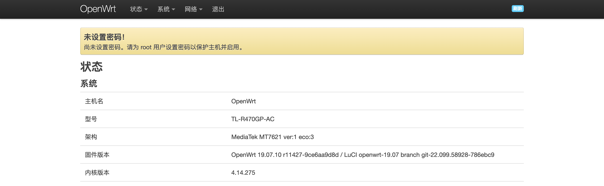
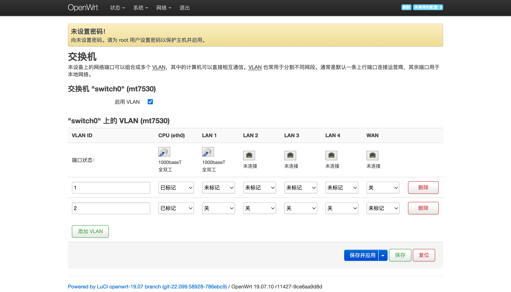

# TL-R470GP-AC Ver5.0

适用于 TL-R470GP-AC Ver5.0 的 OpenWrt 19.07 版本





## 刷入步骤

0. 通过编程器备份 flash

1. 自行寻找使能 telnet 或 ssh 的方法

2. 通过 `mtd -r write u-boot-mt7621.bin factory_boot` 刷入 u-boot

   u-boot 可在 [这里下载](https://github.com/varieget/uboot-mt7621/actions)

   也可以选择自行编译，下面是需要注意的参数。

   ```
   Parse flash type: NOR
   set partition table: 192k(u-boot),64k(factory),-(firmware)
   set kernel offset: 0x40000
   set reset button pin: 8
   set system led pin: 15
   set CPU frequency: 880 MHz
   set DRAM frequency: 1200 MT/s
   Parse DDR init parameters: DDR3-128MiB
   Set baud rate: 115200
   ```

3. 访问 http://192.168.1.1/ 通过 failsafe 页面上传 OpenWrt 固件

   选择 `sysupgrade.bin` 上传，稍等片刻

4. 通过浏览器访问 http://192.168.1.1/ 进入 OpenWrt
